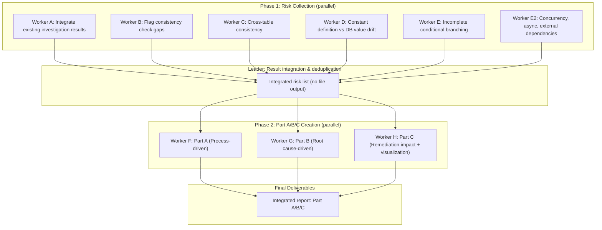

> This is a generic skill from [CLysis](https://github.com/t-hasuike/CLysis).
> Terminology can be customized via `config/terminology.md`.

# /current-distortion -- Distortion Analysis Skill

## Overview

Systematically detect "distortions" (validation gaps, implicit dependencies, type comparison traps, etc.) lurking in legacy code and organize findings from three perspectives (business process-driven, root cause-driven, and mermaid overview). This skill produces structured, actionable reports.

**Design Philosophy**: "Detect risks" then "Organize from 3 perspectives" (output-centric 2-Phase design). Distortion investigation does not produce standalone artifacts; instead, risks are naturally embedded within the Part A/B/C output.

See `config/terminology.md` for term customization.

## Scope

### Target
- Real-world problems existing in codebase across multiple repositories
- Cross-repository problems spanning service boundaries (P7-P11)
- Language/framework-specific structural distortions (P1-P6)
- Data context loss during data transitions (P11)

### Out of Scope
- Hypothetical/generic anti-patterns (comprehensive SOLID violations, etc.)
- Security vulnerability audits (handled by `/review-code`)
- Performance optimization (separate investigation)
- Problems requiring business specification changes (requires human decision first)
- Operational knowledge loss (addressed via documentation and knowledge management)

---

## Target

$ARGUMENTS

## Usage

### Command Syntax

```
/distortion-analysis [repository-name] [target-area]
/distortion-analysis Phase 1 [repository-name] [target-area]
/distortion-analysis Phase 2
```

### Examples

```
# Default (all-in-one: Phase 1 -> Phase 2 in sequence)
/distortion-analysis your-ec-repo checkout-flow
/distortion-analysis your-backend-repo order-delivery

# Step-by-step execution (explicit Phase)
/distortion-analysis Phase 1 your-backend-repo order-delivery
/distortion-analysis Phase 2

# Discussion integration
/distortion-analysis your-ec-repo checkout-flow --discussion 42
```

When Phase is omitted, it runs as all-in-one (All). Step-by-step execution requires explicit Phase specification.

---

## Execution Flow

```
Phase omitted (default): Phase 1 -> Leader integration -> Phase 2 (all-in-one)
Phase 1 only: Risk collection -> Leader verbally reports count & severity distribution to User
Phase 2 only: Takes Phase 1 integration results as input -> Creates Part A/B/C
```

### Overall Flow



---

## Phase 1: Risk Collection

### Purpose

Detect all risks that serve as material for Part A/B/C. Runs integration of existing investigation results and code distortion investigation (4 perspectives) in parallel.

### Worker Formation

Launch 6 workers in parallel.

| Worker | Agent Type | Assignment | Investigation Content | Pattern Coverage |
|--------|-----------|------------|----------------------|-----------------|
| Worker A | investigator | Integrate existing investigation results | Extract and integrate known risks from past reports in reports/ | All patterns |
| Worker B | investigator | Flag consistency check gaps | Implicit dependencies on shared flags, missing soft-delete flag / JOIN conditions | P1, P4, P11 |
| Worker C | investigator | Cross-table consistency | Missing foreign key constraints, data inconsistency between tables | P2, P5, P11 |
| Worker D | investigator | Constant definition vs DB value drift | Mismatch between Enum/constant definitions and DB stored values, hardcoding | P2, P3 |
| Worker E | investigator | Incomplete conditional branching | Language-specific type comparison traps, insufficient branching, validation gaps | P3, P6 |
| Worker E2 | investigator | Concurrency, asynchronous, and external dependencies | Lack of idempotency, unreplayable transitions, async boundary gaps, single points of failure | P7, P8, P9, P10 |

### 11 Problem Patterns (P1-P11)

Each worker uses these as detection criteria:

| ID | Pattern Name | Description | Detection Focus |
|----|-------------|-------------|----------------|
| P1 | Implicit shared flag dependency | Multiple processes reference the same flag with different assumptions | Cross-search references to columns/variables containing `flag`. Record "whose/what" flag using Subject-First Rule |
| P2 | Constant/Enum mismatch | Mismatch between code constant definitions and DB stored values, or between multiple repositories | Compare Enum definitions, `const` declarations, and DB initial data |
| P3 | Type comparison traps | Language-specific loose comparison pitfalls (e.g., PHP `==` vs `===`, missing strict mode in array search) | Loose comparisons, missing strict parameters, switch statement type matching |
| P4 | Soft-delete/JOIN condition gaps | Missing logical deletion conditions (e.g., soft-delete flags) or JOIN conditions | Search SQL queries, ORM scopes, raw queries |
| P5 | Implicit value conversion | Unintended type/value conversions affecting processing results | Track casts, type conversion functions, date/time parsing |
| P6 | Insufficient branching | Unhandled cases, if-else without else, switch without default | Branch coverage verification, missing error handling |
| P7 | Non-idempotent concurrent operations | Concurrent operations on same resource lack idempotency; data inconsistency on collision | Database/file mutations without idempotency guarantees; high request concurrency without locking |
| P8 | Unreplayable state transitions | Processing failure mid-way cannot safely retry due to irreversible side effects | External API calls with DB update after; SFTP sends then DB updates; message bus publishes before persistence |
| P9 | Async boundary gaps | Integrity between synchronous and asynchronous processing not guaranteed | Order confirmation (sync) -> fulfillment dispatch (async); status update flags stuck in intermediate states |
| P10 | External dependency single points of failure | External service dependencies lack redundancy, timeout design, or recovery paths | SQS message loss on processing failure; no retry limit on service failures; no fallback paths |
| P11 | Data context loss | Data loses intent/metadata as it passes through transformation programs | SQL identity binding loss when written by external process; session-dependent context not persisted; type/meaning divergence across service boundaries |

### 6 Distortion Patterns (A-F)

| ID | Pattern Name | Description | Typical Example |
|----|-------------|-------------|----------------|
| A | Invalid value passes through | Due to insufficient validation, values that should be rejected flow to downstream processing | Expired items included in cart checkout |
| B | Stops midway | Some processing succeeds but downstream processing fails or becomes inconsistent | Order confirms but routing to fulfillment errors |
| C | No check exists | Required validation logic does not exist at all | No expiration check at payment time |
| D | Design flaw | Structural design issues (responsibility separation failures, circular dependencies, inappropriate architecture) | Session-dependent pricing design; multiple competing Enum systems in parallel |
| E | Security defect | Missing authentication, authorization, or input validation | session_regenerate_id not implemented; BFF auth check missing |
| F | Integrity mismatch | Value, type, or semantic mismatches across multiple systems (cross-system inconsistency) | ProductType int vs string across repos; PrintingCompanyTypes values reversed between systems |

### Subject-First Rule

When documenting risks, always explicitly state "whose/what" as the subject for flags, variables, and columns.

```
Bad: "When soft-delete flag is 0..."
Good: "When event table's soft-delete flag (event logical deletion flag) is 0..."

Bad: "publication_end_date is not checked"
Good: "Event's publication end date (event.publication_end_date) is not checked in PaymentProcessor.php's payment processing"
```

### Phase 1 Output

**No file output by default.** The leader receives all workers' results, performs deduplication and integration, and holds them locally. Passes directly to Phase 2.

**When Phase 1 only is executed**: The leader verbally reports the integration summary (count, severity distribution) to the user. Only output to an intermediate file if the user explicitly requests "save to file."

---

## Phase 2: Part A/B/C Creation

### Purpose

Organize all risks collected in Phase 1 from 3 perspectives and create final deliverables.

### Worker Formation

Launch 3 workers in parallel.

| Worker | Agent Type | Assignment | Output File |
|--------|-----------|------------|-------------|
| Worker F | general-purpose | Part A: Business Process-driven | Part A section of `reports/distortion-report-[repo]-[area]-[date].md` |
| Worker G | general-purpose | Part B: Root Cause-driven | Part B section of same file |
| Worker H | general-purpose | Part C: Remediation Impact-driven + Visualization | Part C section of same file |

**Note**: The integrated report is a single file. In Phase 2, the leader integrates the 3 workers' outputs into 1 file. Each worker creates only their respective section; the leader performs integration.

### Part A: Business Process-driven

Map all risks to business processes (e.g., PR1-PR5 or your project's process definitions).

- Place risks at each process sub-step
- List distortion-discovered risks and existing investigation risks without distinction
- Include source breakdown (existing investigation: Y items + distortion survey: Z items) in the overview section

### Part B: Root Cause-driven

Classify all risks by problem pattern (P1-P11) and map to distortion patterns (A-F).

**Part B Responsibility**: Describe state and severity (why it happens + how critical). Delegate remediation approach to Part C.

- Analyze root causes for each pattern
- Present remediation approach and effort estimate
- **Remediation Priority Table** (the core of Part B): List remediation targets, resolved risks, and ROI

### Part C: Remediation Impact-driven (WHAT TO DO)

Organize remediation priority, remediation class, side effects, and ordering constraints for all risks. Provide a decision-maker-oriented view.

**Remediation Class Classification**:

| Class | Meaning | Criteria |
|-------|---------|----------|
| **Quick Fix** | Single file, few lines, no side effects | Low difficulty + high severity |
| **Planned Fix** | Multiple files, no design change needed | Medium difficulty + high severity |
| **Architecture Fix** | Includes design changes, cross-cutting | High difficulty OR P7-P10 pattern |
| **Deferred** | Currently no business impact, high fix cost | High difficulty + low severity |

- Remediation priority matrix (ROI: difficulty vs resolved count)
- Remediation side-effect map (when Fix A impacts System B)
- Remediation ordering constraints (dependencies between fixes)

---

## Output Format

### File Name

```
reports/distortion-report-[repository]-[area]-[date].md
```

**Examples**:
```
reports/distortion-report-ec-checkout-flow-2026-03-13.md
reports/distortion-report-backend-order-delivery-2026-03-13.md
```

### Integrated Report Template

```markdown
# [Area] Distortion Analysis Report: [Repository Name]

## Investigation Overview
- Date: YYYY-MM-DD
- Target Repository: [repository-name] (`[repository-path]`)
- Investigation Scope: [target area description]
- Distortions Found: X items (High Y, Medium Z, Low W)

---

## Distortion Investigation Results

### Summary Table

| ID | Distortion Name | Severity | Distortion Pattern | Problem Pattern | Primary File |
|----|----------------|:--------:|:-----------------:|:--------------:|-------------|
| XX-01 | [name] | High/Med/Low | A/B/C | P1-P6 | `[file path]` |

### Detail for Each Distortion

#### XX-01: [Distortion Name]

- **Severity**: High/Medium/Low
- **Distortion Pattern**: A (Invalid value passes) / B (Stops midway) / C (No check) / D (Design flaw) / E (Security defect) / F (Integrity mismatch)
- **Problem Pattern**: P1-P11
- **Repository**: [repository-name]
- **Summary**: [Description with explicit subject - "whose/what"]
- **Passes Through**: [Processing flow that incorrectly succeeds]
- **Fails At**: [Processing that fails or lacks verification]
- **File Paths**:
  - `[file path]` line N: [code description]
- **Affected Business Processes**: PR1-PR5

---

## Part A: Business Process-driven

### Overview
- Risk Count: X items (Existing investigation: Y + Distortion survey: Z)
- Target Processes: PR1-PR5
- Repository: [repository-name]
- Target Area: [area name]

### Risk Count by Process

| Process | High | Med | Low | Total |
|---------|:----:|:---:|:---:|:-----:|
| PR1 ... | ... | ... | ... | ... |
| PR2 ... | ... | ... | ... | ... |
| PR3 ... | ... | ... | ... | ... |
| PR4 ... | ... | ... | ... | ... |
| PR5 ... | ... | ... | ... | ... |
| **Total** | **X** | **Y** | **Z** | **N** |

### Risk Details by Process

#### PR1: [Process Name]
(Risk details. Distortion-discovered and existing investigation risks listed without distinction)

#### PR2: [Process Name]
...

---

## Part B: Root Cause-driven

### Overview
(Same risk count as Part A. Only the perspective differs)

### Risk Count by Pattern

| Pattern | Description | High | Med | Low | Total |
|---------|------------|:----:|:---:|:---:|:-----:|
| P1 | Implicit shared flag dependency | ... | ... | ... | ... |
| P2 | Constant/Enum mismatch | ... | ... | ... | ... |
| P3 | Type comparison traps | ... | ... | ... | ... |
| P4 | Soft-delete/JOIN condition gaps | ... | ... | ... | ... |
| P5 | Implicit value conversion | ... | ... | ... | ... |
| P6 | Insufficient branching | ... | ... | ... | ... |
| P7 | Non-idempotent concurrent operations | ... | ... | ... | ... |
| P8 | Unreplayable state transitions | ... | ... | ... | ... |
| P9 | Async boundary gaps | ... | ... | ... | ... |
| P10 | External dependency single points of failure | ... | ... | ... | ... |
| P11 | Data context loss | ... | ... | ... | ... |
| **Total** | | **X** | **Y** | **Z** | **N** |

### Pattern Details & Remediation Approach

#### P1: Implicit Shared Flag Dependency
**Root Cause**: [analysis]
**Affected Risks**:
- **[XX-01]** [distortion name] [severity]
  - Repository: [repository-name]
  - File Path: `[file path:line number]`

**Remediation Approach**:
1. [specific remediation content]

...

### Remediation Priority

| Priority | Remediation | Resolved Risks | Effort | ROI |
|:--------:|------------|---------------|:------:|:---:|
| **1** | [content] | XX-01 (High) | S/M/L | Highest/High/Med/Low |
| **2** | [content] | XX-02 (High) | S/M/L | High |

---

## Part C: Remediation Impact-driven

### Remediation Class Mapping

| Remediation ID | Remediation Description | Remediation Class | Resolved Risks | Side Effects | Ordering Constraints |
|:------:|---------|:--------:|-----------|--------|---------|
| FIX-01 | [description] | Quick Fix / Planned Fix / Arch Fix / Deferred | XX-01 (High) | None / [Impact Target] | None / After FIX-XX |

### Remediation Priority Matrix

| Priority | Remediation ID | Remediation Description | Resolved Count | Difficulty | ROI |
|:------:|:------:|---------|:--------:|:---------:|:---:|
| **1** | FIX-01 | [description] | N items | Low/Medium/High | Highest/High/Medium/Low |

### Remediation Ordering Constraints

[Draw remediation dependencies using mermaid flowchart]

## Visualization (Supplementing Part A/B/C)

### 1. Processing Flow Diagram (Distortion Occurrence Point Mapping)

[Draw target area processing flow in mermaid flowchart. Color-code distortion points]
- High severity: Red (fill:#e74c3c)
- Medium severity: Orange (fill:#f39c12)
- Low severity: Gray (fill:#95a5a6)

### 2. Root Cause -> Distortion -> Symptom Causality Diagram

[Draw causality from root causes through distortions to user-experienced symptoms in mermaid flowchart]

### 3. Remediation Impact Diagram (Fix Points and Resolved Risks)

[Draw relationship between each fix and directly/indirectly resolved risks in mermaid flowchart]

---

## Remaining Investigation Items

1. [Items not fully investigated]
2. [Items requiring additional investigation]

---

## Next Actions

### Remediation Priority
1. **[Highest]** [remediation content] ([resolved risk IDs])
2. **[High]** [remediation content] ([resolved risk IDs])

### Items Requiring User Decision
1. [Items requiring business judgment]
```

---

## Input Parameters

| Parameter | Description | Required/Optional | Default | Example |
|-----------|------------|-------------------|---------|---------|
| Phase | `Phase 1`, `Phase 2` | Optional | All-in-one when omitted | `Phase 1` |
| Repository Name | Target repository | Required for Phase 1 | -- | `your-backend-repo`, `your-ec-repo` |
| Target Area | Target functional area | Optional | All areas when omitted | `order-delivery`, `checkout-flow`, `pricing` |
| --discussion | Discussion number | Optional | -- | `--discussion 42` |

### --discussion Option

When a Discussion number is specified, a report summary is automatically posted to the GitHub Discussion upon completion.

```
/distortion-analysis your-ec-repo checkout-flow --discussion 42
```

Post content:
- Investigation overview (target, count, severity distribution)
- Remediation priority table (core of Part B)
- Link to integrated report file

---

## Cross-Cutting Risk View

When distortion analysis covers multiple repositories, risks that span repository boundaries require special attention. The **Cross-Cutting Risk View** provides a two-layer management approach:

### L1: Component-Level View
- Risks within a single repository/component
- Managed within each distortion report

### L2: Cross-Cutting View
- Risks that span multiple repositories
- Shared flags referenced differently across repos
- Data flow integrity across service boundaries
- Inconsistent validation between frontend and backend

**When to create L2 view**: After completing L1 analyses for 2+ repositories in related areas, synthesize cross-cutting risks into a separate section or dedicated report.

---

## Related Skills

| Skill | Relationship |
|-------|-------------|
| `/legacy-analyze` | Discovers risks during change-theme investigation -> `/distortion-analysis` organizes systematically |
| `/investigate` | Individual code investigation -> `/distortion-analysis` Phase 1 for distortion-focused investigation |
| `/impact-analysis` | Change impact analysis -> Part B remediation priority judgment benefits from this |

### Skill Chain Examples

```
# From legacy analysis to distortion analysis
/legacy-analyze Phase 1 order-delivery  ->  /distortion-analysis your-backend-repo order-delivery

# From individual investigation to distortion analysis
/investigate ShoppingCartService  ->  /distortion-analysis your-ec-repo checkout-flow

# From distortion analysis to impact analysis
/distortion-analysis your-backend-repo pricing  ->  /impact-analysis price-pattern-fix
```

---

## Reference Files

| File | Purpose |
|------|---------|
| `knowledge/domain/business_processes.md` | Business process definitions. Mapping target for Part A |
| `knowledge/system/overview.md` | Project structure. Understanding cross-repository relationships |
| `knowledge/system/repositories.md` | Repository responsibilities. Judgment for investigation scope |
| `reports/` | Past investigation reports. Source for Phase 1 Worker A to extract existing risks |

---

## I/O Specification

### INPUT

| Type | Content | Required/Optional | Example |
|------|---------|-------------------|---------|
| Phase | Phase 1, Phase 2, or omitted (All) | Optional | `Phase 1`, omitted |
| Repository Name | Target repository | Required for Phase 1/All | `your-backend-repo`, `your-ec-repo` |
| Target Area | Target functional area | Optional | `checkout-flow`, `order-delivery` |
| --discussion | GitHub Discussion number | Optional | `--discussion 42` |

### OUTPUT

| Type | Format | Destination |
|------|--------|-------------|
| Integrated Report | Markdown (distortion results + Part A/B/C) | `reports/distortion-report-[repo]-[area]-[date].md` |

### Prerequisites

- Serena MCP is running
- Target repository is accessible
- For Phase 2 only: Leader holds Phase 1 integration results
- Business process definitions exist in knowledge/domain/ (required for Part A mapping)

### Downstream Skills (Pipeline)

- `/impact-analysis` -- Impact analysis based on Part B remediation priority
- Used as handoff material for implementation phase

### Quality Checklist

- [ ] All risks include file path:line number
- [ ] All risks have distortion pattern (A-F) and problem pattern (P1-P11) assigned
- [ ] Flag/variable descriptions explicitly state "whose/what" (Subject-First Rule)
- [ ] Part A: All risks mapped to business processes
- [ ] Part B: Remediation priority table created (with ROI)
- [ ] Part C: Remediation class mapping, priority matrix, and ordering constraints included
- [ ] Visualization: 3 mermaid diagrams included (flow, causality, remediation impact)
- [ ] Risk counts match across Part A/B/C (same risk set, different perspectives)
- [ ] Remaining investigation items and next actions documented
- [ ] Findings verified against actual code (no hallucinations)
- [ ] P7-P10 risks (cross-repository, concurrency, async, external dependencies) explicitly identified
- [ ] Part C "WHAT TO DO" view is decision-maker-oriented (not just state description)
