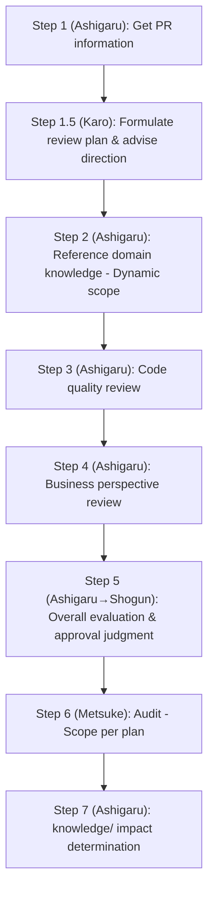

> This is a generic skill from [CLysis](https://github.com/t-hasuike/CLysis).
> Terminology can be customized via `config/terminology.md`.

# PR Review Skill

## Overview

Systematically review pull request code quality and business perspective, providing approval judgment material.

See config/terminology.md for term customization

## Review Target

$ARGUMENTS

## Review Roles and Responsibilities

| Role | Responsibility |
|------|-----------------|
| **Shogun (Leader)** | Approve review plan, make final judgment (Approved / Conditional Approval / Changes Required) |
| **Karo (Planner)** | Formulate review plan (Step 1.5). Advise review direction (focus areas, judgment criteria) based on PR characteristics |
| **Ashigaru (Worker)** | Execute review (Steps 1-5). Follow karo's plan and direction; investigate and report code quality and business perspective |
| **Metsuke (Inspector)** | Audit review results (Step 6). Independently verify quality, completeness, and appropriateness of ashigaru's report |

## Review Flow



## Investigation Procedure

### Step 1: Get PR Information (Ashigaru)
- Retrieve PR overview, changed files, and diffs using GitHub MCP tool
- Assess PR scale: file count, line changes, target repository

### Step 1.5: Formulate Review Plan & Advise Direction (Karo)

Karo determines the PR's characteristics and formulates the plan:

**PR Characteristics Assessment**:
- Does the PR include domain rule changes?
- Does it impact system structure (inter-repository, DB, API)?
- Is it a fix for known architectural issues?
- Is it part of a remediation plan?

**Dynamic Scope Decision for Knowledge References**:

| PR Characteristic | Reference Scope |
|------------------|-----------------|
| All PRs (baseline) | `knowledge/domain/` (domain knowledge for affected process) |
| Domain rule changes | + Detailed review of relevant `knowledge/domain/` files |
| Architecture fix | + `knowledge/quality/distortions/` |
| Remediation-related | + `knowledge/quality/remediation/` |
| System structure change | + `knowledge/system/02_structure/`, `knowledge/system/03_behavior/` |
| Large impact scope | + `knowledge/system/04_change_impact/` |

**Metsuke Audit Scope Decision**:

| PR Scale | Metsuke Scope |
|----------|--------------|
| Small (single file, minor fix) | Lightweight: core checks only (type safety, security basics) |
| Medium (multiple files, logic change) | Standard: + design quality, test coverage |
| Large (10+ files, structural change) | Full audit: + business impact, release risk, architecture alignment |

**Review Direction Guidance** (as appropriate):
- What is the most critical aspect of this PR? (e.g., type safety risk, domain rule change)
- Priority of judgment axes (e.g., security first, performance secondary)
- Judgment criteria if ashigaru is uncertain

**Ashigaru Composition**:
- Small: Task tool (1 worker)
- Medium: Ashigaru (1-2 workers)
- Large: Consult CLAUDE.md "Team Composition Judgment Criteria"

### Step 2: Reference Domain Knowledge - Dynamic Scope (Ashigaru)

Based on Karo's Step 1.5 scope determination:

**Always consult** (all PRs):
- `knowledge/domain/` — domain knowledge for affected process
- `workspace/in_progress/` — ongoing specifications for consistency check

**Optional scope** (per PR characteristics):
- `knowledge/quality/distortions/` — check for regressions to known issues
- `knowledge/quality/remediation/` — ensure no conflicts with active remediation plans
- `knowledge/system/02_structure/` — repository boundaries, architecture constraints
- `knowledge/system/03_behavior/` — process flows, data flows
- `knowledge/system/04_change_impact/` — change impact patterns
- `knowledge/standards/review/` — review criteria checklists

### Step 3: Code Quality Review (Ashigaru)

**Core Checklist**:
- [ ] Type safety and type system usage
- [ ] Strict mode declaration where required
- [ ] Proper parameter binding (SQL injection prevention)
- [ ] Output escaping (XSS prevention)
- [ ] Error handling and exception management
- [ ] N+1 query prevention (eager loading)
- [ ] Consistency with existing code patterns
- [ ] Test coverage for changes

### Step 4: Business Perspective Review (Ashigaru)

**Domain Rule Alignment**:
- Do changes align with domain rules documented in `knowledge/domain/`?
- Subject-explicit naming: Are domain terms clearly defined with "whose/what"?

**User Impact Assessment**:
- Impact on primary users identified in domain knowledge

**Release Risk Assessment**:
- Conflicts with other PRs or concurrent changes?
- Data migration or database updates required?
- Rollback capability?

### Step 5: Overall Evaluation & Approval Judgment (Ashigaru → Shogun)

**Ashigaru** organizes review findings and reports to **Shogun**. **Shogun** makes the final decision:

| Judgment | Criteria |
|----------|----------|
| **Approved** | No quality or business perspective concerns |
| **Conditional Approval** | Minor findings; mergeable after fixes |
| **Changes Required** | Quality or business perspective issues; re-review after changes |

### Step 6: Metsuke Audit (Metsuke)

Audit scope per Step 1.5 plan:

**Lightweight Audit** (small PRs):
- Type system usage
- Security basics (OWASP Top 10 core items)

**Standard Audit** (medium PRs):
- Above +
- Design quality (separation of concerns, SOLID principles)
- Test coverage completeness

**Full Audit** (large PRs):
- Above +
- Business impact (user impact, financial impact)
- Release risk
- Architecture alignment (repository boundaries)

## Critical Rules

**F002 Rule**: Shogun must not review directly. Always delegate to Ashigaru. Shogun's role is to approve plans, make final judgments, and coordinate team.

## Output Format

```markdown
# PR#[Number] Review Report

**PR**: [Title]
**Repository**: [Target repository (each repository if multiple)]
**Review Date**: YYYY-MM-DD

---

## 1. PR Overview

### Change Description
[Describe PR purpose and overview in 1-2 sentences]

### Changed File List
| File Path | Change Type | Lines |
|-----------|-----------|-------|
| xxx.ts | Addition | +50 |

---

## 2. Code Quality Review

### Positive Points
- [Include specific file:line numbers]

### Improvement Suggestions
| Location | Description | Priority | Proposal |
|----------|-------------|----------|----------|
| xxx.ts:45 | ... | High | ... |

### Required Fixes
| Location | Description | Reason |
|----------|-------------|--------|
| xxx.ts:78 | ... | ... |

---

## 3. Business Perspective Review

### Requirements Alignment
| Requirement | Status | Judgment | Notes |
|-----------|--------|----------|-------|
| xxx feature | OK | OK | ... |

### Domain Knowledge Alignment
**Referenced Domain Knowledge**:
- `knowledge/domain/xxx.md`
- `workspace/in_progress/yyy.md`

| Item | Domain Knowledge | Implementation | Judgment |
|------|-----------------|---------------|----------|
| xxx | ... | ... | OK |

---

## 4. Test Coverage

### Test Case Assessment
| Test Case | Judgment | Notes |
|-----------|----------|-------|
| xxx | OK | ... |

---

## 5. Overall Evaluation

### Approval Judgment
- **Approved** / **Conditional Approval** / **Changes Required**

### Reason
[State judgment reason]

### Next Actions
- [ ] [Assignee]: [Task description]

---

## 6. Metsuke Audit Results

### Audit Scope
[Lightweight / Standard / Full Audit]

### Findings
| Item | Result | Notes |
|------|--------|-------|
| Type safety | OK / Review | ... |
| Security | OK / Review | ... |

**Metsuke Audit Report**: Save to `reports/` (F007 compliance)

---

## 7. knowledge/ Impact Determination

### Documents Requiring Updates
| Document | Impact | Action |
|----------|--------|--------|
| none / `knowledge/domain/xxx.md` | ... | `/doc-organize` handoff |
```

## Quality Checklist

Upon review completion, verify the following:

- [ ] Did Karo formulate the review plan in Step 1.5?
- [ ] Was the knowledge reference scope determined per PR characteristics?
- [ ] Were all changed files reviewed?
- [ ] Were domain knowledge references checked per scope?
- [ ] Were code quality and business perspective both reviewed?
- [ ] Are file path:line numbers included?
- [ ] Is the approval judgment clear (Approved/Conditional/Changes Required)?
- [ ] Was Metsuke audit performed per Step 1.5 scope?
- [ ] Was knowledge/ impact determination completed?
- [ ] Was the report saved to `reports/`? (F006 compliance)

---

## I/O Specification

### INPUT
| Type | Description | Required/Optional | Example |
|------|-------------|-------------------|---------|
| PR number | PR number to review | Required | `12345` |
| Repository | Target repository | Optional | `backend`, `frontend` |
| Review focus | Specify particular focus | Optional | `security`, `performance`, `business` |

### OUTPUT
| Type | Format | Destination |
|------|--------|-------------|
| Review report | Detailed Markdown (7 sections: PR overview, code quality, business perspective, test coverage, overall evaluation, metsuke audit, knowledge/ impact) | `reports/` + stdout (Shogun report) |
| Metsuke audit report | Independent verification findings | `reports/` (F007 compliance) |

### Prerequisites
- GitHub MCP is available
- Serena MCP is running (for code reading)
- `knowledge/domain/`, `reports/`, `workspace/` accessible when available
- Karo formulates plan (Step 1.5) before Ashigaru begins work

### Downstream Skills (Pipeline)
| Condition | Downstream Skill |
|-----------|-----------------|
| knowledge/ update needed | `/doc-organize` — document update planning |
| New distortion pattern found | `/current-distortion` — systematic analysis |
| Approved → merge | PR merge and deployment |

### Quality Checkpoints
- [ ] Karo approved the review plan (Step 1.5)?
- [ ] Scope of domain knowledge references determined per PR characteristics?
- [ ] All changed files reviewed?
- [ ] Code quality + business perspective + test coverage reviewed?
- [ ] File path:line numbers included?
- [ ] Approval judgment clear (Approved/Conditional/Changes Required)?
- [ ] Metsuke audit performed per planned scope?
- [ ] knowledge/ impact determination completed?
- [ ] Report saved to `reports/`?
