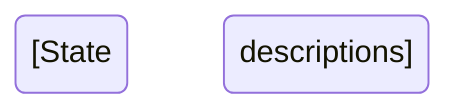
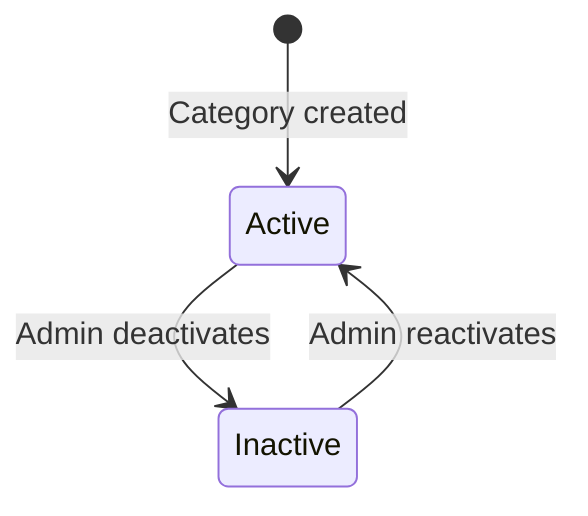

# Domain Knowledge Template

## Usage

Use when organizing investigation reports (output/) into domain knowledge (input/domain/).

```
"Organize output/xxx.md according to the following template,
and save as input/domain/xxx.md"
```

---

## Template

```markdown
# [Domain Name]

**Version**: x.x
**Last Updated**: YYYY-MM-DD
**Accuracy**: [Phase N investigation (code reading) / planned specification / design proposal]
**Source**: [Investigation report path or reference]

---

## Overview

[What this domain manages, for whom, and why -- in 3 lines or fewer]

**Scope**: [What this file covers]
**Out of Scope**: [What this file does NOT cover -- with references to where that information lives]

---

## 1. Data Model

### 1.1 Key Tables and Models

| Table | Model | Primary Key | Description |
|-------|-------|:-----------:|-------------|
| `table_name` | `ModelName` | `pk_column` | [What this model represents -- whose/what data] |

### 1.2 Key Flags and Statuses

| Column | Type | Constant/Enum | Value | Meaning |
|--------|:----:|---------------|-------|---------|
| `column_name` | string | `ConstantName::VALUE` | '0' | [meaning -- clarify whose/what status] |

---

## 2. Business Rules

### 2.1 [Rule Name]

[Observed, confirmed business rule from code. No speculation.]

**Applies to**: [whose context -- e.g., "partner invoices", "user subscription calculations"]

---

## 3. Process Flow / Status Transitions

[mermaid diagrams as appropriate: stateDiagram / sequenceDiagram / flowchart]



---

## 4. External Integrations / Batch Processing

| Function | Execution Method | Target System | Notes |
|----------|-----------------|--------------|-------|
| [name] | [scheduled/manual/user-triggered] | [target] | [frequency, command name, whose context] |

---

## 5. Implementation Constraints

| Constraint | Details |
|-----------|---------|
| Soft delete | All queries must include logical deletion check |
| Type safety | Use strict types in source files |
| [other] | [details] |

---

## 6. Usage Context

Where this domain knowledge is used and by which components:

| Usage Scenario | Called By | Notes |
|---|---|---|
| [scenario -- whose context] | [Controller/Service/Command class path] | - |

---

## 7. Related Domains

Directly connected domains in the value chain:

| Related Domain | Relationship Type | Reference |
|---------------|------------------|-----------|
| [domain name] | [input / output / shared data / prerequisite] | [file path] |

---

## 8. Related Files

### Commands
- `path/to/command` -- [description]

### Models
- `path/to/model` -- [description -- whose data]

### Services / UseCases
- `path/to/service` -- [description -- whose context]

### Controllers
- `path/to/controller` -- [description]

---

## Change History

| Version | Date | Changes |
|---------|------|---------|
| x.x | YYYY-MM-DD | [description] |
```

---

## Section Purpose Guide

| Section | Purpose | When to Fill |
|---------|---------|-------------|
| **Overview** | Quick orientation for any reader | Always |
| **1. Data Model** | Tables, flags, and enums relevant to this domain | When DB-backed |
| **2. Business Rules** | Confirmed logic from code (not speculation) | Always |
| **3. Process Flow** | Visual representation of state/sequence | When stateful |
| **4. External Integrations** | Batch jobs, API calls, third-party systems | When applicable |
| **5. Constraints** | Technical limitations and coding rules | Always |
| **6. Usage Context** | Where this knowledge is consumed | When cross-cutting |
| **7. Related Domains** | Dependencies and upstream/downstream links | Always |
| **8. Related Files** | Quick reference to source code locations | Always |

---

## Extraction Guidelines

### Information to Keep
- Definitions and terminology
- Mapping tables (codes, enums, flags)
- Business rules (confirmed from code)
- Constraints and exceptions
- Specific values and codes
- Process flows and state transitions
- Subject-first descriptions ("whose/what" for every flag and variable)

### Information to Remove
- Investigation process and history ("we investigated...")
- Temporary analysis and hypotheses
- Duplicate information already covered in other domain files
- Project-specific paths (use generic placeholders)

---

## Example: Product Category Domain Knowledge

```markdown
# Product Categories

**Version**: 1.0
**Last Updated**: 2026-01-22
**Accuracy**: Phase 1 investigation (code reading)
**Source**: output/product-category-investigation.md

---

## Overview

Product category definitions and classification rules for the e-commerce platform.
Categories determine pricing tiers, available options, and sales channel restrictions.

**Scope**: Category master data, classification rules, pricing linkage
**Out of Scope**: Individual product pricing (see pricing.md)

---

## 1. Data Model

### 1.1 Key Tables and Models

| Table | Model | Primary Key | Description |
|-------|-------|:-----------:|-------------|
| `categories` | `Category` | `id` | Product category master -- defines available product tiers |

### 1.2 Key Flags and Statuses

| Column | Type | Constant/Enum | Value | Meaning |
|--------|:----:|---------------|-------|---------|
| `is_active` | boolean | `CategoryStatus::ACTIVE` | true | Category is available for new product assignments |

---

## 2. Business Rules

### 2.1 Category-Price Linkage

Prices are defined per category in the `price` table. When selecting a category,
the system references the category master to determine applicable pricing rules.

**Applies to**: Product pricing during checkout and catalog display

### 2.2 Channel Restrictions

Enterprise category is available only through specific sales channels.

**Applies to**: Sales channel routing for corporate clients

---

## 3. Process Flow / Status Transitions



---

## 5. Implementation Constraints

| Constraint | Details |
|-----------|---------|
| Category change | When changing categories, related price tables must also be updated |
| Deletion | Categories with active products cannot be deleted |

---

## 7. Related Domains

| Related Domain | Relationship Type | Reference |
|---------------|------------------|-----------|
| Pricing | output | pricing.md |
| Sales Channels | shared data | sales-channels.md |

---

## Change History

| Version | Date | Changes |
|---------|------|---------|
| 1.0 | 2026-01-22 | Initial creation from investigation |
```
