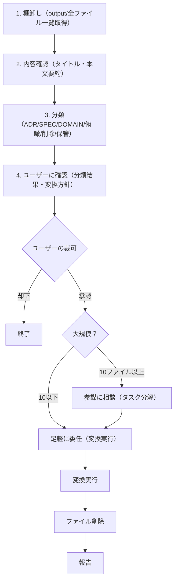

> This is a generic skill from [decouple-legacy](https://github.com/t-hasuike/decouple-legacy-skills).
> Terminology can be customized via `config/terminology.md`.

# ドキュメントアーカイブスキル

## 役割

調査レポート庫（output/）を整理し、確定知識（input/）に昇華させる役目を担う。調査の成果を体系的に記録し、組織の知識資産として継承する。

## 目的

output/ にたまった調査レポート・分析資料を適切な形式に変換・分類し、入出力ディレクトリ間を整序する。

```
output/（一時的な調査結果）
     |
  棚卸し・分類
     |
input/context/adr/（意思決定履歴）
input/context/（俯瞰レポート・複合仕様）
input/domain/（確定済み事実）
```

## アーカイブの4つのカテゴリー

| カテゴリ | 形式 | 置き場所 | 用途 | 例 |
|---------|------|---------|------|-----|
| **ADR** | 意思決定記録 | `input/context/adr/` | 「なぜこの決定？」という文脈を記録 | ADR-2026-03-16-feature-calc-method.md |
| **SPEC** | 詳細仕様書 | `input/context/` | エンジニアが読んで実装できるレベルの詳細 | feature-calculation-spec.md |
| **DOMAIN** | ドメイン知識 | `input/domain/` | ビジネスルール・用語定義（確定済み事実） | calculation-rules.md |
| **俯瞰レポート** | 複合分析 | `input/context/` | 複数の関連システム・概念を概観 | payment-system-overview.md |
| **削除対象** | -- | （削除） | 一時作業文書・重複・陳腐化済み | -- |
| **保管** | -- | `input/context/archive/` | 参考資料として保存（将来の類似調査の手がかり） | -- |

## 実行フロー



## 分類基準

### (1) ADR（意思決定記録）に分類する条件

- 複数の選択肢から1つを選んだ経過が記載されている
- 意思決定の背景（Context）が説明されている
- 決定の根拠（Rationale）がある
- 決定による影響（Consequences）が記載されている

**例**:
- 計算ロジックの実装方式を選定した記録
- 支払い方法の変更決定
- リポジトリ間の責務分割を決定した時の議論

### (2) SPEC（詳細仕様書）に分類する条件

- 処理フロー・アルゴリズム・実装方法が詳細に記載されている
- エンジニアが読んで即座に実装・修正できるレベル
- APIのリクエスト/レスポンス形式、DBスキーマの詳細、バリデーションルール等
- 既知の歪みパターン・エラーハンドリングを含む

### (3) DOMAIN（ドメイン知識）に分類する条件

- 確定済みの事実・ビジネスルール・用語定義である
- 変更可能性が低い（DBマスタで管理されるものは除外）
- 複数エンジニアが参照する基本用語・分類体系
- 「なぜそうなっているか」の歴史的背景を含む

**除外対象（DBが真実の源）**:
- 現在の価格テーブル（価格は日々変動、DBを参照すべき）
- 現在の集計データ（時刻・合計等）

### (4) 俯瞰レポート（複合分析）に分類する条件

- 複数のService/Model/リポジトリの関係を横断的に分析したもの
- 複数概念の統合（例:「支払いシステム全体の構成」）
- マネージャー向けサマリー + エンジニア向け詳細の両層構造
- mermaid図で可視化されている

### (5) 削除対象に分類する条件

- 一時的な作業メモ（調査過程の草稿）
- 他ファイルに統合済み
- 陳腐化（既に状況が変わっている）
- 重複（既存ドメイン知識と内容が同一）

**確認項目**:
- 元の報告者に「削除する旨」を通知したか
- 相互参照しているファイルはないか

### (6) 保管対象に分類する条件

- 参考資料的価値がある（将来の類似調査の手がかり）
- 決定には至らなかったが、有用な分析がある
- レガシーコード読解の記録（将来の大規模改修時に有用）

**保管先**: `input/context/archive/` にリダイレクト

## 変換ルール

### ADRテンプレート（input/context/adr/）

```markdown
# ADR: [タイトル]

**日付**: YYYY-MM-DD
**対象リポジトリ**: [リポジトリ名]
**提案者**: [調査実施者名]
**ステータス**: 提案中 / 承認済み / 実装待ち / 完了

## 背景（Context）
[意思決定が必要になった背景。「なぜこの問題が発生したのか」を説明]

## 発見事項（Findings）
[調査で判明した事実。複数の選択肢と各々のメリット・デメリット]

**選択肢A**: ...（メリット: ..., デメリット: ...）
**選択肢B**: ...（メリット: ..., デメリット: ...）

## 決定事項（Decision）
**採択**: 選択肢B

**理由**: [なぜこれを選んだのか]

## 根拠（Rationale）
[技術的・ビジネス的な根拠。実装の詳細は別途spec を参照]

## 影響（Consequences）
[この決定による影響。修正が必要なファイル・スケジュール等]

- 修正対象ファイル: [ファイル]
- 影響を受けるService: [Service名]
- 実装スケジュール: [予定日]

## 未解決事項
[この決定では解決しなかった課題・将来の再検討が必要な点]

## 関連ドメイン知識
- [参照ファイル]: [簡潔な説明]

## バージョン履歴
| 日付 | 版 | 内容 |
|------|-----|------|
| YYYY-MM-DD | 1.0 | 初版 |
```

### SPECテンプレート（input/context/）

```markdown
# [タイトル] 仕様書

**最終更新**: YYYY-MM-DD
**対象リポジトリ**: [リポジトリ名]
**関連ADR**: ADR: [タイトル]（意思決定の背景）

## サマリー
[1-2段落で仕様全体を概観。エンジニアが読んで即座に理解できるレベル]

## [主要セクション（内容に応じて自由に構成）]

### 処理フロー
[mermaid sequenceDiagram推奨。複数Service間のやり取りが見える図]

### データモデル
[テーブル・API request/responseの詳細。エンジニアが実装に使える形式]

### バリデーション・エラーハンドリング
[入力値の制約、エラーケース、エラーメッセージ]

### 既知の歪みパターン
[実装上の制約・過去の判断・技術的負債。「なぜこんなことになってるの？」への回答]

## 未解決事項
[実装完了時点で残された課題。「今後改修する場合の要検討事項」]

## 関連ドメイン知識
- input/domain/xxx.md: [簡潔な説明]

## バージョン履歴
| 日付 | 版 | 内容 |
|------|-----|------|
| YYYY-MM-DD | 1.0 | 初版 |
```

### DOMAINテンプレート（input/domain/）

```markdown
# [ドメイン概念名]

**最終更新**: YYYY-MM-DD
**用語定義**: [1行で定義]

## 概要
[ビジネスドメインにおける定義・背景。なぜこの概念が必要か]

## 主要な概念・分類

[ビジネスルール、分類体系、制約条件等]

### [サブ概念1]
[詳細]

### [サブ概念2]
[詳細]

## 歴史的背景
[「なぜこうなっているか」の経緯。過去の判断・制約の理由]

## エンジニアへの指示
[実装時に気をつけるべき点。テーブル参照、検証ロジック等]

## 関連するService / Model
- [Service名]: [用途]
- [Model名]: [用途]

## バージョン履歴
| 日付 | 版 | 内容 |
|------|-----|------|
| YYYY-MM-DD | 1.0 | 初版 |
```

## 共通ルール

### 主語明示ルール（Subject-First Rule）
- ドメイン用語・フラグ名の説明には必ず「誰の・何の」を明示
- 例：NG 「flagが0の場合...」 → OK 「記事の削除フラグ(flag)が0の場合...」

### 参照の明示
- 引用元コードは `app/Services/xxx.php:45-67` の形式で記載
- 前提知識は `input/domain/` のファイル名で参照
- ADRは `[ADR: タイトル名](../../adr/ファイル名.md)` で相互参照

### フォーマット規約
- mermaid図は積極的に使用（可視化の効果が実証済み）
- コード引用は最小限に（陳腐化防止）

### 価格・変動値の扱い
- 変動する値は書かない（DBが真実の源）
- 計算式・ロジックはOK（例: 「合計 = 基本価格 x 数量」）

## I/O仕様

### INPUT
| 種別 | 内容 | 必須/任意 | 例 |
|------|------|-----------|-----|
| フィルタ | 対象ファイルの絞り込み | 任意 | `--type adr` / `--since 2026-02-01` / デフォルト: output/全ファイル |

### OUTPUT
| 種別 | 形式 | 出力先 |
|------|------|--------|
| アーカイブ計画 | 分類リスト + Markdown形式 | stdout（リーダーへの報告） |
| 変換済みファイル | input/配下の各ディレクトリ | input/context/adr/, input/context/, input/domain/ |
| 削除ファイル一覧 | テキストリスト | stdout（確認用） |

### 前提条件
- output/ にアーカイブ対象ファイルが存在すること
- input/ 配下のディレクトリ構造が整っていること

### 品質チェックポイント
- [ ] 全ファイルを棚卸しし、落ちがないか
- [ ] 分類理由を明確に述べたか
- [ ] 相互参照（ADR → SPEC → DOMAIN）が設定されているか
- [ ] 主語明示ルールを守ったか
- [ ] 削除対象の依存関係を確認したか

## 参考: 既存スキルとの連携

- `/investigate` -- コード調査の出力をこのスキルでADR/SPECに変換
- `/service-spec` -- Service仕様サマリーをこのスキルでSPEC/ADRに分類
- `/impact-analysis` -- 影響分析レポートを俯瞰レポートに昇華
- `/project-guide` -- プロジェクト全体の構成を把握した上で分類を判断

---

## スキル実行例

### 小規模（3ファイル）
```
リーダー: /archive-output --type adr --since 2026-03-01
足軽: 分類報告（3ファイル）
リーダー: 承認
足軽: 変換実行 → 完了報告
```

### 大規模（15ファイル）
```
リーダー: /archive-output （全ファイル）
足軽: 棚卸し・分類報告
リーダー: 「参謀に相談が必要」と判断
参謀: タスク分解（3-4フェーズに分割）
リーダー: チーム編成・足軽に委任
足軽(複数): 並列変換実行
足軽: 完了報告
```
