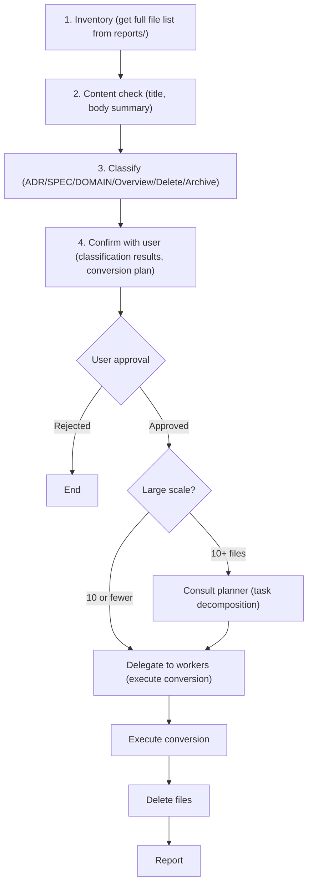

> This is a generic skill from [CLysis](https://github.com/t-hasuike/CLysis).
> Terminology can be customized via `config/terminology.md`.

# Document Archive Skill

## Role

Responsible for organizing the investigation report repository (reports/) and elevating it to confirmed knowledge (knowledge/). Systematically records investigation results and inherits them as organizational knowledge assets.

## Purpose

Convert and classify accumulated investigation reports and analysis materials in reports/ into appropriate formats, ordering the reports/knowledge directories.

```
reports/ (temporary investigation results)
     |
  Inventory & classification
     |
knowledge/adr/ (decision history)
knowledge/system/ or knowledge/domain/ (overview reports, compound specifications)
knowledge/domain/ (confirmed facts)
```

## 4 Archive Categories

| Category | Format | Destination | Purpose | Example |
|----------|--------|------------|---------|---------|
| **ADR** | Decision record | `knowledge/adr/` | Record context: "Why this decision?" | ADR-2026-03-16-feature-calc-method.md |
| **SPEC** | Detailed specification | `knowledge/system/` | Engineer-readable implementation-level detail | feature-calculation-spec.md |
| **DOMAIN** | Domain knowledge | `knowledge/domain/` | Business rules, term definitions (confirmed facts) | calculation-rules.md |
| **Overview report** | Compound analysis | `knowledge/system/` | Overview of multiple related systems/concepts | payment-system-overview.md |
| **Delete target** | -- | (delete) | Temporary working documents, duplicates, obsolete | -- |
| **Archive** | -- | `knowledge/archive/` | Preserved as reference material (clue for future similar investigations) | -- |

## Execution Flow



## Classification Criteria

### (1) Criteria for ADR (Decision Record) Classification

- Multiple options were evaluated and one was selected
- Background of the decision (Context) is explained
- Rationale for the decision exists
- Consequences of the decision are documented

**Examples**:
- Record of selecting an implementation approach for calculation logic
- Payment method change decision
- Discussion when deciding repository responsibility boundaries

### (2) Criteria for SPEC (Detailed Specification) Classification

- Processing flow, algorithm, implementation method documented in detail
- Engineer-readable level for immediate implementation/modification
- API request/response formats, DB schema details, validation rules, etc.
- Includes known distortion patterns and error handling

### (3) Criteria for DOMAIN (Domain Knowledge) Classification

- Confirmed facts, business rules, term definitions
- Low probability of change (exclude items managed in DB master)
- Basic terms and classification systems referenced by multiple engineers
- Includes historical context of "why it's this way"

**Exclusion targets (DB is the source of truth)**:
- Current price tables (prices fluctuate daily; should reference DB)
- Current aggregate data (timestamps, totals, etc.)

### (4) Criteria for Overview Report (Compound Analysis) Classification

- Cross-sectional analysis of relationships across multiple Services/Models/repositories
- Integration of multiple concepts (e.g., "Overall payment system architecture")
- Dual-layer structure: manager-facing summary + engineer-facing detail
- Visualized with mermaid diagrams

### (5) Criteria for Delete Target Classification

- Temporary working notes (investigation process drafts)
- Already merged into other files
- Obsolete (situation has already changed)
- Duplicate (content identical to existing domain knowledge)

**Verification items**:
- Has the original reporter been notified of the deletion intent?
- Are there cross-referenced files?

### (6) Criteria for Archive Classification

- Has reference value (clue for future similar investigations)
- Useful analysis that did not lead to a decision
- Records of legacy code reading (useful for future large-scale modifications)

**Destination**: Redirect to `knowledge/archive/`

## Conversion Rules

### ADR Template (knowledge/adr/)

```markdown
# ADR: [Title]

**Date**: YYYY-MM-DD
**Target Repository**: [Repository name]
**Proposer**: [Investigator name]
**Status**: Proposed / Approved / Awaiting Implementation / Completed

## Context
[Background necessitating the decision. Explain "why this problem occurred"]

## Findings
[Facts discovered through investigation. Multiple options with pros/cons for each]

**Option A**: ... (Pros: ..., Cons: ...)
**Option B**: ... (Pros: ..., Cons: ...)

## Decision
**Adopted**: Option B

**Reason**: [Why this was chosen]

## Rationale
[Technical and business rationale. Refer to separate spec for implementation details]

## Consequences
[Impact of this decision. Files requiring modification, schedule, etc.]

- Files to modify: [files]
- Affected Services: [Service names]
- Implementation schedule: [Planned date]

## Unresolved Issues
[Issues not resolved by this decision. Points requiring future reconsideration]

## Related Domain Knowledge
- [Reference file]: [Brief description]

## Version History
| Date | Version | Description |
|------|---------|-------------|
| YYYY-MM-DD | 1.0 | Initial version |
```

### SPEC Template (knowledge/system/)

```markdown
# [Title] Specification

**Last Updated**: YYYY-MM-DD
**Target Repository**: [Repository name]
**Related ADR**: ADR: [Title] (decision background)

## Summary
[1-2 paragraphs overviewing the full specification. Engineer-readable level for immediate understanding]

## [Main Sections (freely structured based on content)]

### Processing Flow
[mermaid sequenceDiagram recommended. Diagram showing interactions between multiple Services]

### Data Model
[Table, API request/response details. Format usable by engineers for implementation]

### Validation and Error Handling
[Input value constraints, error cases, error messages]

### Known Distortion Patterns
[Implementation constraints, past decisions, technical debt. Answers "why is it like this?"]

## Unresolved Issues
[Issues remaining at implementation completion. "Items requiring consideration for future modifications"]

## Related Domain Knowledge
- knowledge/domain/xxx.md: [Brief description]

## Version History
| Date | Version | Description |
|------|---------|-------------|
| YYYY-MM-DD | 1.0 | Initial version |
```

### DOMAIN Template (knowledge/domain/)

```markdown
# [Domain Concept Name]

**Last Updated**: YYYY-MM-DD
**Term Definition**: [1-line definition]

## Overview
[Definition and background in the business domain. Why this concept is needed]

## Key Concepts and Classifications

[Business rules, classification systems, constraints, etc.]

### [Sub-concept 1]
[Details]

### [Sub-concept 2]
[Details]

## Historical Background
[Context of "why it's this way." Reasons for past decisions and constraints]

## Instructions for Engineers
[Points to be aware of during implementation. Table references, validation logic, etc.]

## Related Services / Models
- [Service name]: [Purpose]
- [Model name]: [Purpose]

## Version History
| Date | Version | Description |
|------|---------|-------------|
| YYYY-MM-DD | 1.0 | Initial version |
```

## Common Rules

### Subject-First Rule
- When describing domain terms and flag names, always explicitly state "whose/what"
- Example: NG "flag is 0..." -> OK "Article's deletion flag (flag) is 0..."

### Explicit References
- Source code citations in `app/Services/xxx.php:45-67` format
- Background knowledge referenced by `knowledge/domain/` file names
- ADRs cross-referenced as `[ADR: Title](../../knowledge/adr/filename.md)`

### Format Conventions
- Use mermaid diagrams actively (visualization effectiveness proven)
- Minimize code citations (prevent obsolescence)

### Handling Prices and Variable Values
- Do not write variable values (DB is the source of truth)
- Formulas and logic are OK (e.g., "total = base price x quantity")

## I/O Specification

### INPUT
| Type | Description | Required/Optional | Example |
|------|-------------|-------------------|---------|
| Filter | Narrow target files | Optional | `--type adr` / `--since 2026-02-01` / default: all files in reports/ |

### OUTPUT
| Type | Format | Destination |
|------|--------|-------------|
| Archive plan | Classification list + Markdown format | stdout (report to leader) |
| Converted files | Under respective knowledge/ directories | knowledge/adr/, knowledge/system/, knowledge/domain/ |
| Delete file list | Text list | stdout (for confirmation) |

### Prerequisites
- Archive target files exist in reports/
- Directory structure under knowledge/ is set up

### Quality Checkpoints
- [ ] Inventoried all files with no omissions
- [ ] Clearly stated classification reasons
- [ ] Cross-references (ADR -> SPEC -> DOMAIN) are set
- [ ] Subject-First Rule followed
- [ ] Verified dependencies of delete targets

## Reference: Integration with Existing Skills

- `/current-spec` -- Convert investigation/specification output to ADR/SPEC using this skill
- `/change-impact` -- Elevate impact analysis reports to overview reports
- `/project-guide` -- Make classification decisions after understanding overall project structure

---

## Skill Execution Examples

### Small Scale (3 files)
```
Leader: /archive-reports --type adr --since 2026-03-01
Worker: Classification report (3 files)
Leader: Approved
Worker: Execute conversion -> completion report
```

### Large Scale (15 files)
```
Leader: /archive-reports (all files)
Worker: Inventory and classification report
Leader: Determines "planner consultation needed"
Planner: Task decomposition (3-4 phases)
Leader: Team formation, delegate to workers
Workers (multiple): Execute conversions in parallel
Workers: Completion report
```
