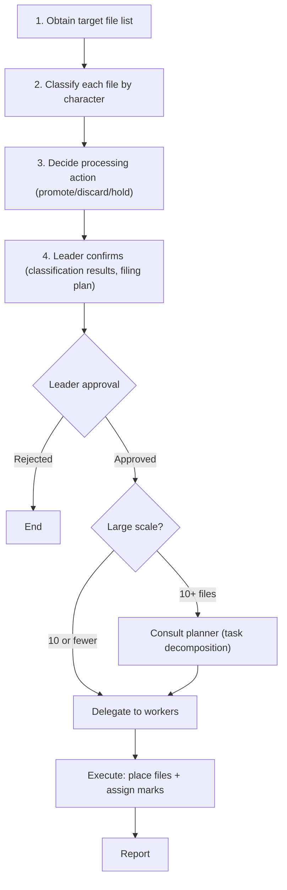

> This is a generic skill from [CLysis](https://github.com/t-hasuike/CLysis).
> Terminology can be customized via `config/terminology.md`.

# /doc-organize — Document Organization & Filing (Execution)

## Role

**Execution**: Receives diagnostic results from `/doc-check`, then executes document organization. Has two functions:

| Function | Content | Target |
|----------|---------|--------|
| **Promotion** | Classify reports/ files by character and file them into knowledge/ or workspace/ | New files |
| **Reorganization** | Verify existing knowledge/ files are in the correct character/location, then move/rename as needed | Existing files |

```
/doc-check (diagnosis) → detect problems, promotion decision, placement errors
       ↓
/doc-organize (execution) → classify and file or reorganize
```

**Role responsibilities**:
| Role | Responsibility |
|------|---|
| **Leader** | Approve organization/reorganization decisions, make final judgments |
| **Planner** | For large-scale reorganization (10+ files), task decomposition and planning strategy |
| **Worker** | Execute character classification, file placement, and mark assignments |
| **Auditor** | Quality audit of classification results (accuracy, naming compliance) |

**Strict compliance with F002**: Leader does not personally organize files. Consult planner, delegate execution to workers, request auditor for quality assurance.

**Distinction from `/doc-check`**:
- `/doc-check` = **Judge** (integrity verification + As-Is/To-Be promotion judgment + placement error detection)
- `/doc-organize` = **Execute** (character classification → placement → mark assignment → move)

---

## Classification Framework: 2-Layer Structure

### Layer 1: Document Character (What is this document for?)

| Character | Definition | Storage | Example | Decision Authority |
|-----------|------------|---------|---------|-------------------|
| **Domain Knowledge** | Business rules, term definitions, confirmed facts | `knowledge/domain/` | Photo size definitions, incentive calculation rules | Worker can classify |
| **System Knowledge** | Architecture, structure, behavior, infrastructure configuration | `knowledge/system/` | Repository structure, database connection config, S3 bucket layout | Worker can classify |
| **Quality Records** | Distortions, risks, technical debt, diagnostic results | `knowledge/quality/` | Core distortion patterns, cross-cutting risk inventory | Worker can classify |
| **Decision Records** | Option comparison, decision rationale, consequences (ADR format) | `workspace/in_progress/adr/` | Payment calculation method selection, repository split decision | Leader makes final decision |
| **Implementation Specs** | Detailed specifications for engineer implementation | `workspace/in_progress/` | API specs, validation rule details | Worker can classify |
| **Runbooks** | Environment setup, troubleshooting, operational procedures | `knowledge/runbooks/` | Local dev environment setup, deployment procedures | Worker can classify |
| **Standards & Guidelines** | Checklists, maturity models, review rules | `knowledge/standards/` | PR checklist, legacy maturity model | Decision maker makes final decision |

**Escalation Path for Uncertain Classification**:
- Worker uncertain → Report to leader for judgment
- Leader uncertain → Request analysis from planner, then leader decides based on results
- Document matches multiple characters and requires decomposition → Leader makes final decision (see PRD decomposition rule)
- New standards/guidelines creation → Requires decision maker approval (updates to existing standards can be decided by leader)

### Representative Document Type Mapping

| Document Type | Applicable Character | Rationale |
|-------------|-------------|-----------|
| PRD (Product Spec) | **Compound** (decompose by section) | Spans domain knowledge + system knowledge + implementation specs |
| Non-functional requirements (SLA, performance) | System knowledge | Describes infrastructure configuration and constraints |
| Test specs | Implementation specs | Engineers use for implementation and verification |
| UI/UX specs | Domain knowledge | Defines business processes and user operations |
| API specs | Implementation specs | Endpoint/request/response format details |
| ER diagrams, table designs | System knowledge | Data structure and relationship descriptions |
| Deployment procedures | Runbooks | Environment operation procedures |
| Release notes | Decision records | Records change context and impact |

### Layer 2: Processing Decision (What to do?)

| Decision | Definition | Conditions |
|----------|------------|-----------|
| **Promote** | Integrate summary version into knowledge/ or workspace/ | Referenced across multiple sessions + knowledge confirmed |
| **Discard** | Delete temporary notes, duplicates, obsolete content (see "Discard Criteria" below for details) | Content merged elsewhere or information outdated |
| **Hold** | Keep in reports/ (waiting for decision maker judgment) | Future plans, improvement proposals (To-Be) requiring decision maker approval |

### Discard Criteria

#### 4 Conditions for Discard

| Condition | Definition | Verification Method |
|-----------|------------|-------------------|
| **Merged** | Content has been integrated into existing knowledge/ files | grep knowledge/ for keywords from the original file. 5+ hits AND visual confirmation of content coverage |
| **Obsolete** | Documented information has diverged from current code/specifications | Verify whether file paths, class names, and method names mentioned in the document exist in current codebase |
| **Duplicate** | Another file already documents the same information | Compare file names, headings, and content similarity. Discard candidate at 80%+ content overlap |
| **Temporary note** | Session working notes with no value for persistence | Content is bullet-point-only, TODO/memo format, no dates, or context is unclear |

#### Discard Prohibitions

1. **No deletion of files created within 2 weeks**: Files less than 2 weeks old are marked as discard candidates only. Do not delete immediately (they may be referenced across sessions)
2. **No deletion of referenced files**: Files linked from other Markdown files (`[text](path)` format) must not be deleted without first updating the referencing files
3. **No deletion based solely on automated judgment**: Do not finalize discard based on grep results or filename similarity alone. Always require human confirmation (leader or decision maker)

#### Fallback

When in doubt, do not delete. Add the following mark to the file header and report to leader:

```
> **Discard candidate**: [reason in one line] (YYYY-MM-DD classified by worker)
```

### Promotion Decision Criteria (Purpose-Based)

| Investigation Purpose | Processing Decision | Decision Maker |
|--------|------------|--------|
| Current spec survey (As-Is) | **Immediate promotion** | Leader/Worker |
| Future plans, improvement proposals (To-Be) | **Hold** (promote after decision maker approval) | Decision maker |
| One-time investigation | **Discard candidate** (discard if no value) | Leader |

### Naming Convention (Prefixes)

File names should make character and purpose immediately clear:

| Character | Prefix | Applied to |
|-----------|--------|-----------|
| System knowledge (bird's eye) | `birdseye_` | High-level overviews, architecture diagrams |
| System knowledge (fish eye) | `fisheye_` | Time-series flows, process tracing |
| System knowledge (worm's eye) | `wormseye_` | Implementation details, specification confirmation |
| Quality records (bird's eye) | `birdseye_` | Risk overview |
| Quality records (worm's eye) | `wormseye_` | Distortion pattern details |
| Domain knowledge (bird's eye) | `birdseye_` | Business process overview |
| Domain knowledge (fish eye) | `fisheye_` | Business workflows, time-series processes |
| Domain knowledge (worm's eye) | `wormseye_` | Business rules, term definitions, detailed specs |
| Decision records | `adr_` | ADR-format decision records |
| Implementation specs | `spec_` | Engineer-readable detailed specifications |
| Runbooks | `runbook_` | Environment setup, operational procedures |
| Standards & guidelines | `standard_` | Checklists, maturity models, review rules |

---

## Character Classification Standards

### Criteria for Domain Knowledge Classification

- Confirmed facts, business rules, term definitions
- Low likelihood of change (exclude items managed in database master)
- Basic terms and classification systems referenced by multiple engineers
- Includes historical context of "why it's this way"
- Code-independent (exists and makes sense without code)

### Criteria for System Knowledge Classification

- System structure (repository configuration, connection methods, infrastructure)
- Flows (business flows, data flows, processing sequences)
- I/O interfaces, external integration specifications
- System structure/connection/infrastructure facts ("this is how it's configured" not "how we should configure it")

### Criteria for Quality Records Classification

- Code distortions and technical debt patterns
- Risk assessment and impact analysis results
- Diagnostic/audit reports
- Describes "what is the problem" and "what is the risk" (not structural explanation)

### Criteria for Decision Records Classification

- Multiple options evaluated and one selected
- Decision context, rationale, and consequences documented

### Criteria for Implementation Specs Classification

- Detail level: engineers can implement/fix immediately
- API specs, validation rules, error handling
- Processing flow and algorithm details
- Directly tied to code implementation (assumes specific Controller/Service/method)
- Remediation plans for quality risks include implementation details

### Criteria for Runbooks Classification

- Records "who/when/which procedure"
- Covers environment setup, deployment, troubleshooting, operational procedures
- Written as repeatable procedures (action description, not knowledge explanation)

### Criteria for Standards & Guidelines Classification

- Defines "how to evaluate" and "what to check"
- Review rules, checklists, maturity models, quality standards
- Functions as "measuring stick" for evaluating other documents

### Priority Classification Rule for Multiple Matches

When a document matches multiple character conditions, classify in this order:

1. **"Does it exist independent of code?"**: Exists without code → Domain knowledge. Depends on code implementation details → Implementation specs
2. **"Is it a problem record or structure record?"**: Problem/risk/debt record → Quality records. Structure/mechanism record → System knowledge
3. **"Is it procedure description or knowledge description?"**: Procedure/operation description → Runbooks. Concept/specification description → use 1-2 above
4. **Uncertain?** → Consult with leader

#### PRD (Compound Document) Decomposition Rule

PRDs span multiple characters. Decompose by section during promotion:

| PRD Section | Promotion Target Character |
|-----------|-----------|
| Business requirements, term definitions | Domain knowledge |
| System configuration, architecture | System knowledge |
| API specs, database design | Implementation specs |
| Non-functional requirements | System knowledge |
| Screen specs, operation flow | Domain knowledge |

---

## Promotion Rules

- Integrate **summary version** into knowledge/ file (not full copy of reports/ content)
- Can **delete** the reports/ original file, with conditions:
  - Summary version in promotion target includes investigation **facts** and **conclusions** (no need to re-read the original)
  - Execute git commit before deletion for history traceability
- If not deleting, prepend to the original: `> **Promoted**: integrated into knowledge/xxx/yyy.md (YYYY-MM-DD)`
- When creating new files, apply naming convention (prefixes) by character

---

## Execution Flow



---

## Common Rules

### Language and Tone

Clear, professional reporting with business etiquette. Clearly state OK/NG, explicitly state what is unclear.

### Subject-First Rule

When describing domain terms and flag names, always explicitly state "whose/what".

### References

- Source code citations: `app/Services/xxx.php:45-67`
- Background knowledge: referenced by `knowledge/domain/` file names

### Handling Prices and Variable Values

- Do not document current prices (DB is source of truth)
- Formulas and logic are OK

### Diagram Standards

- Never use emoji
- Use mermaid diagrams for visualization

---

## I/O Specification

### INPUT
| Type | Content | Required/Optional |
|------|---------|-----------|
| Target scope | reports/ or knowledge/ file path | Required |
| /doc-check results | Promotion candidates, placement errors | Optional (improves accuracy if provided) |

### OUTPUT
| Type | Format | Destination |
|------|--------|-------------|
| Organization result report | Markdown | reports/ + stdout |
| Filed files | knowledge/ or workspace/ | Character-specific storage location |

### Prerequisites
- knowledge/ directory structure is established
- Promotion rules (README.md v3.2) are accessible

### Downstream Skills (Pipeline)

| Skill | Condition | Instruction |
|-------|-----------|-------------|
| `/doc-check` | When file moves or renames occurred | **Running `/doc-check` after organization is mandatory and must not be skipped.** Report to leader for approval, then execute |
| `/doc-update` | When freshness verification of promoted files is needed | Execute after `/doc-check` completes; propose to leader and await judgment |

> **Fallback**: If prerequisites are not met, report to leader and await further instructions

---

## Related Skills

| Skill | Relationship |
|--------|-------------|
| `/doc-check` | **Upstream**: Diagnosis results (promotion candidate list) used as input |
| `/doc-update` | **Downstream**: Freshness management of promoted knowledge/ files |
| `/current-spec` | **Source**: Investigation results output to reports/, then input to doc-organize |
